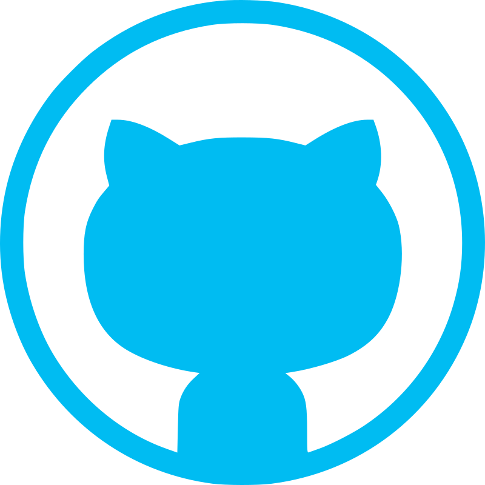

# Hi There! I'm Younes Rouhafzae ✋

## 👨‍💻 About Me

- 💻 Backend Developer focused on **Python** & **Django**
- 🌍 Computer **Engineering student** at Golestan University
- 🛠️ I learn primarily by building real-world projects.
- 📚 Currently learning Docker and containerization.
- 🚀 My goal is to build scalable, impactful systems and grow alongside experienced developers and great teams.

## 🛠️ Tech Stack

### Backend

### Database

### Frontend

### Tools

### Other

-------
## ⭐ Featured Projects
### 🎵 BeatFlow
#### A modern music platform built with Django.
- Personal music **management**
- **Search** for songs
- Create and manage **playlists**
- **Explore** music through a dedicated discovery page
- Follow your favorite **artists**
- and many more features.

### 🤖 Telegram Group Manager
#### A Python Telegram bot for advanced group management and moderation.
- **Whispering** between group members
- Group **message** management
- Warning, mute, ban, and kick system
- **Postgres** database

### 💰 Crypto Bot
#### A Python Telegram bot for tracking cryptocurrency prices and market alerts using APIs.
- Get real-time cryptocurrency **prices**
- Create and manage personal **watchlists**
- Price **alerts** and **notifications**
- A professional UI 
- **Postgres** database

### 🌐 Portfolio
#### My personal portfolio website to learn more about me and explore my work.

## 🔨 Currently Working On
> ### 🎵 BeatFlow
------
## 📊 GitHub Stats

## 📫 Connect With Me

  
  
  

